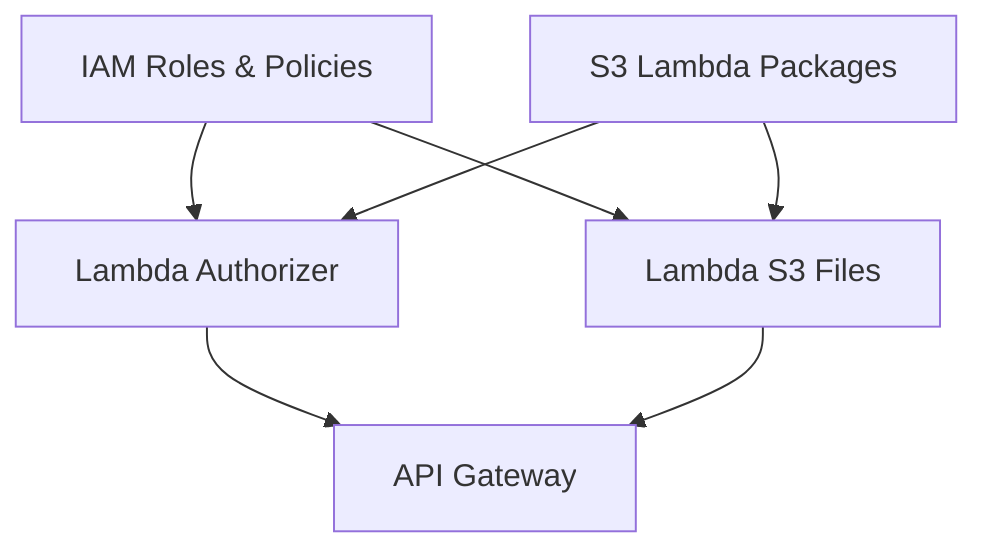

# Terraform Infrastructure

This directory contains all Terraform modules for deploying the S-Imperatives Infrastructure as Code project to AWS. The modules are organized by service type and designed for reusability across environments.

> 📖 **Part of**: [S-Imperatives Infrastructure as Code](../README.md)  
> 🚀 **Deployment**: [Automation Scripts](../bin/README.md)

## Module Architecture

The infrastructure is organized into logical modules that can be deployed independently while maintaining proper dependency relationships:

```
terraform/
├── api-gateway/          # HTTP API Gateway with custom authorization
├── iam/                  # IAM roles, policies, and user groups
├── lambda/              # Lambda function deployments
│   ├── authoriser/      # API Gateway authorizer function
│   └── s3-files/       # S3 file operations function
└── s3/                  # S3 storage configuration
    ├── lambda-packages/ # Lambda deployment package storage
    └── terraform-state/ # Terraform state management
```

## Deployment Dependencies

The modules have specific deployment order requirements:



### Deployment Order
1. **Foundation**: IAM and S3 Lambda Packages
2. **Compute**: Lambda Functions (Authorizer and S3 Files)
3. **API Layer**: API Gateway with integrations

## Module Overview

### Core Infrastructure

#### [IAM Configuration](iam/README.md)
- **Purpose**: Identity and access management for all services
- **Resources**: Lambda execution roles, user groups, S3 policies
- **Dependencies**: None (foundation module)

#### [S3 Storage](s3/README.md)
- **Purpose**: Storage configuration for packages and state
- **Submodules**: Lambda packages, Terraform state
- **Dependencies**: None (foundation module)

### Lambda Functions

#### [Authorizer Lambda](lambda/authoriser/README.md)  
- **Purpose**: Custom API Gateway authorization
- **Resources**: Lambda function, CloudWatch logs, permissions
- **Dependencies**: IAM roles, S3 lambda packages

#### [S3 Files Lambda](lambda/s3-files/README.md)
- **Purpose**: S3 CRUD operations through API
- **Resources**: Lambda function, S3 permissions, CloudWatch logs  
- **Dependencies**: IAM roles, S3 lambda packages

### API Layer

#### [API Gateway](api-gateway/README.md)
- **Purpose**: HTTP API with Lambda integrations
- **Resources**: API Gateway, routes, authorizers, integrations
- **Dependencies**: Both Lambda functions

## Configuration Management

### Environment Isolation
Each module supports environment-specific configurations:

```
module/
├── envs/
│   ├── dev.hcl          # Development backend config
│   ├── staging.hcl      # Staging backend config  
│   └── prod.hcl         # Production backend config
└── envs/
    ├── dev.tfvars       # Development variables
    ├── staging.tfvars   # Staging variables
    └── prod.tfvars      # Production variables
```

### Backend Configuration
All modules use S3 remote state with environment-specific paths:
- **State Bucket**: `si-iac-terraform-state-store`
- **State Key Pattern**: `${environment}/${module}/terraform.tfstate`
- **Region**: Configurable per environment

### Variable Management
- **Common Variables**: Prefix, environment, region, tags
- **Module-Specific**: Each module has specialized variables
- **Sensitive Data**: Uses AWS Secrets Manager or Parameter Store

## Deployment Methods

### Automated Deployment (Recommended)
```bash
# Deploy all infrastructure
./bin/all-create.sh

# Destroy all infrastructure  
./bin/all-destroy.sh

# Individual module deployment
./bin/iam.sh
./bin/s3-lambda-packages.sh
./bin/lambda-authoriser.sh
./bin/lambda-s3-files.sh
./bin/api-gateway.sh
```

### Manual Deployment
```bash
cd terraform/${module_name}

# Initialize with environment backend
terraform init -backend-config="envs/dev.hcl"

# Plan changes
terraform plan

# Apply changes
terraform apply

# Destroy (if needed)
terraform destroy
```

### Environment-Specific Deployment
```bash
# Development
terraform apply -var-file="envs/dev.tfvars"

# Production
terraform apply -var-file="envs/prod.tfvars"
```

## Best Practices

### Module Design
- **Single Responsibility**: Each module has a clear, focused purpose
- **Loose Coupling**: Modules communicate through well-defined outputs
- **High Cohesion**: Related resources grouped logically
- **Reusability**: Support for multiple environments and configurations

### State Management
- **Remote State**: All modules use S3 backend
- **State Locking**: DynamoDB for concurrent execution protection
- **Environment Isolation**: Separate state files per environment
- **Version Control**: State file versioning enabled

### Security
- **Least Privilege**: Minimal required permissions
- **Encryption**: All data encrypted at rest and in transit
- **Secrets Management**: No hardcoded secrets in Terraform
- **Network Security**: Proper VPC and security group configuration

### Monitoring
- **Resource Tagging**: Consistent tagging strategy
- **CloudWatch Integration**: Logging and metrics collection
- **Cost Tracking**: Resource-level cost attribution
- **Compliance**: Security and compliance scanning

## Development Workflow

### Making Changes
1. **Plan**: Always run `terraform plan` before applying
2. **Review**: Review all changes before execution
3. **Test**: Test in development environment first
4. **Document**: Update README files for significant changes
5. **Version**: Tag releases for production deployments

### Module Development
1. **Structure**: Follow established directory structure
2. **Variables**: Define clear input variables with descriptions
3. **Outputs**: Provide meaningful outputs for other modules
4. **Documentation**: Maintain comprehensive README files
5. **Testing**: Test modules in isolation and integration

## Troubleshooting

### Common Issues
1. **State Lock**: Clear locks carefully with `terraform force-unlock`
2. **Dependencies**: Ensure deployment order is followed
3. **Permissions**: Verify IAM permissions for Terraform execution
4. **Versions**: Keep Terraform and provider versions consistent

### Debug Mode
Enable detailed logging:
```bash
export TF_LOG=DEBUG
terraform apply
```

### State Inspection
```bash
# List state resources
terraform state list

# Show specific resource
terraform state show aws_lambda_function.example

# Import existing resources
terraform import aws_lambda_function.example function-name
```

## Terraform Standards

### Version Requirements
- **Terraform**: >= 1.0
- **AWS Provider**: ~> 5.0
- **Null Provider**: ~> 3.0

### Naming Conventions
- **Resources**: `${var.prefix}-${var.environment}-${purpose}`
- **Variables**: snake_case with descriptive names
- **Outputs**: snake_case with clear descriptions
- **Tags**: Consistent tagging across all resources

### File Organization
- `main.tf`: Primary resource definitions
- `variables.tf`: Input variable definitions
- `outputs.tf`: Output value definitions
- `providers.tf`: Provider configurations
- `versions.tf`: Terraform and provider version constraints
- `data.tf`: Data source definitions (if needed)

## Related Documentation

- [Source Code](../src/README.md) - Lambda function implementations
- [Automation Scripts](../bin/README.md) - Deployment automation
- [Project Overview](../README.md) - Complete project documentation

---

*This directory provides the infrastructure foundation for the entire S-Imperatives serverless platform.*